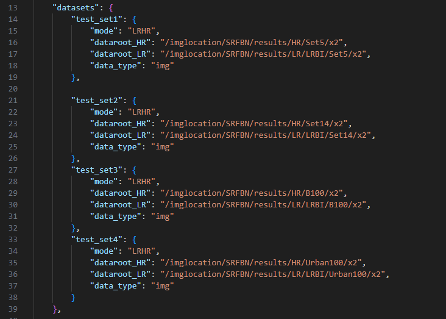

# Partial Kernel Sharing: Improved Parameter-sharing Methods for Single Image Super-Resolution Networks
Anonymous WACV25 submission .<br>

### SRFBN-PS Repository
Our code is built on [SRFBN_CVPR19](https://github.com/Paper99/SRFBN_CVPR19). <br/>
If you encounter any problems using the code, please refer to [SRFBN Issue Threads](https://github.com/Paper99/SRFBN_CVPR19/issues) first. <br/>

### Environments
- Python 3.7.13
- PyTorch (1.13.1), torchvision
- skimage
- imageio
- tqdm 
- pandas
- cv2 
- Matlab 
- einops

### Testset Preparation (By SRFBN authors)

1. You can first download SR benchmark (Set5, Set14, B100, Urban100 and Manga109) from [GoogleDrive](https://drive.google.com/file/d/1fC0AeoCLK8Oo3utnVa3E_r_45sJla4d1/view) or [BaiduYun](https://pan.baidu.com/s/1pTw5EE-N-GclI7Yj5SnnOA)(code:z6nz).

2. Run `./results/Prepare_TestData_HR_LR.m` in Matlab to generate HR/LR images with different degradation models.

### Test & Evaluation

We provide the pretrained models in `models` directory.
To test SRFBN-PS on benchmark dataset, first check the dataset location on line 13-39 of `./options/test/test_SRFBNps_xN_BI.json`<br/>
<br/>
then, run one of the following test codes:

   ```shell
   python test.py -opt options/test/test_SRFBNps_x2_BI.json
   python test.py -opt options/test/test_SRFBNps_x3_BI.json
   python test.py -opt options/test/test_SRFBNps_x4_BI.json
   ```

### Acknowledgements

- We would like to express our thanks to the authors of the [SRFBN_CVPR19](https://github.com/Paper99/SRFBN_CVPR19) for generously releasing their code to the public.
